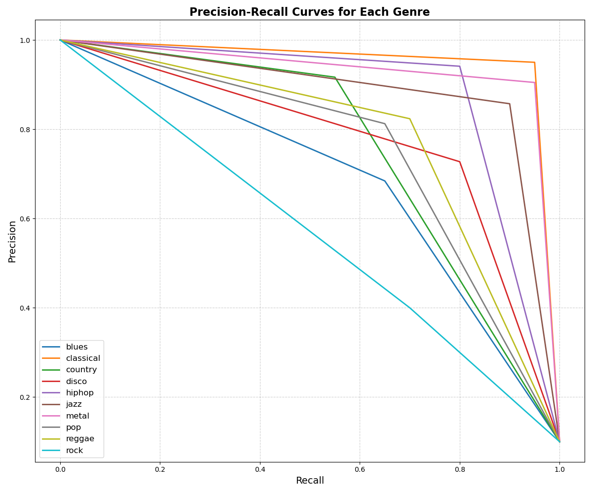
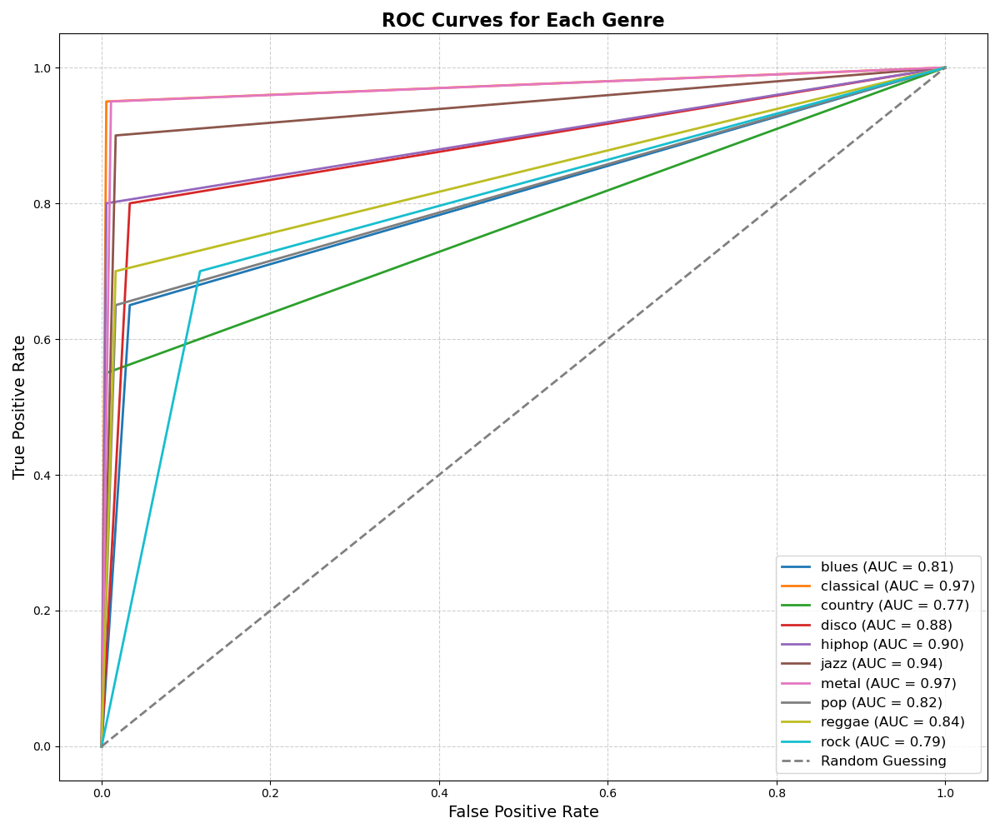

# Music Genre Classification using CNN + RNN 

This project implements a PyTorch adaptation of the model from [Choi et al.](https://github.com/keunwoochoi/music-auto_tagging-keras) to train a **Genre Classification** system using a **Convolutional Neural Network (CNN)** combined with a **Recurrent Neural Network (RNN)**. The model is trained on the [GTZAN dataset](http://marsyas.info/downloads/datasets.html). The primary goal of this project is to classify audio tracks into genres based on their acoustic characteristics.

## Project Overview

The main objective is to develop and fine-tune a deep learning model that can classify audio samples into 10 different genres by analyzing their **mel-spectrograms**. The approach combines the strengths of **CNNs** for feature extraction and **RNNs** for capturing temporal dependencies in audio data.

The project includes:
- **Audio preprocessing** using mel-spectrogram extraction.
- **CNN + RNN architecture** for learning both spatial (CNN) and temporal (RNN) patterns.
- **Training** and **testing** routines with model evaluation.
- **Batch processing** to handle large datasets efficiently on MPS (or CPU if necessary).

## Understanding Mel-Spectrograms

A **mel-spectrogram** is a visual representation of an audio signal that has been converted from the time domain into the frequency domain, using the **mel scale**. It shows how the energy of different frequency components of an audio signal evolves over time, which is essential for tasks like speech recognition, music genre classification, and other audio-related machine learning applications. The **mel scale** represents how humans perceive sound, particularly the way we differentiate pitch. While a raw spectrogram provides a linear frequency representation, the mel-spectrogram applies a non-linear transformation to align frequency with human auditory perception. Low frequencies are spaced linearly, while higher frequencies are spaced logarithmically, making it more suited for processing natural sounds in tasks such as **music genre classification** or **speech processing**. 

Mel-spectrograms are generated by breaking down an audio signal into short overlapping frames and computing the **short-time Fourier transform (STFT)** to obtain a spectrogram, which represents the magnitude of different frequency components over time. The frequency axis is then mapped onto the mel scale using a set of triangular filters, resulting in the mel-spectrogram. To further enhance the features, the amplitude values are typically converted to a logarithmic scale, which emphasizes lower intensities and makes it easier for neural networks to learn from subtle frequency patterns. This transformation is widely used in deep learning applications where the model needs to recognize specific features from audio data.

### Target Genres:
The model classifies audio into one of the following 10 genres:
- **HipHop**
- **Jazz**
- **Country**
- **Disco**
- **Reggae**
- **Metal**
- **Pop**
- **Blues**
- **Classical**
- **Rock**

## Dataset: GTZAN

**Dataset Details**:
- **Number of tracks**: 1000
- **Duration of each track**: 30 seconds
- **Sampling rate**: 22.05 kHz
- **Genres**: Blues, Classical, Country, Disco, HipHop, Jazz, Metal, Pop, Reggae, Rock

You can download the dataset from the [official GTZAN dataset page](http://marsyas.info/downloads/datasets.html).

### Audio Preprocessing

Before feeding the audio data into the model, we extract **mel-spectrograms** from each track. The mel-spectrogram provides a time-frequency representation of the audio signal, making it suitable for processing by convolutional layers.

#### Steps for Audio Preprocessing:
1. **Resampling**: All audio tracks are resampled to a consistent sample rate of 12 kHz.
2. **Mel-Spectrogram Extraction**: Using **Librosa**, mel-spectrograms are generated with the following parameters:
   - **Number of mel bins**: 96
   - **FFT window size**: 512
   - **Hop length**: 256
   - **Duration of each frame**: 29.12 seconds
3. **Log-Scaling**: The mel-spectrograms are log-scaled to improve model performance by stabilizing variations in amplitude.

## The Model

### CNN + RNN Architecture

A combination of CNN and RNN layers process the mel-spectrograms:

- **CNN Layers**:
  - The **CNN** extracts local spatial features from the mel-spectrogram. This helps capture the structure of audio signals in both time and frequency domains.
  - Five convolutional layers followed by **max-pooling** and **batch normalization** are used to reduce dimensionality and improve generalization.
  
- **RNN Layers**:
  - The **RNN** (specifically, GRU) captures sequential dependencies in the mel-spectrograms. Since music signals are time-dependent, RNNs are well-suited for learning the temporal aspects of the data.
  - Two **GRU** layers are used after the CNN layers to capture the sequential patterns.

- **Output Layer**:
  - A **fully connected (Dense) layer** followed by a **sigmoid activation** is used to make genre predictions. 

### Model Training

- **Loss function**: `CrossEntropyLoss` is used for multi-class classification.
- **Optimizer**: The model is trained using the `Adam` optimizer with a learning rate of 0.001.
- **Batch size**: Default batch size of 32 is used for training, but it can be customized via the command line.
- **GPU support**: The model is trained on **MPS** (if available) or falls back to **CPU**.

## Relevant Papers

Some key papers that inspired the architecture and techniques used in this project:

1. **[Automatic Tagging Using Deep Convolutional Neural Networks](https://arxiv.org/abs/1606.00298)**  
   *Keunwoo Choi et al., 2016*  
   This paper introduces the use of deep CNNs for automatic music tagging and genre classification using mel-spectrograms.

2. **[CRNN: Convolutional Recurrent Neural Networks for Music Classification](https://arxiv.org/abs/1609.04243)**  
   *Keunwoo Choi et al., 2016*  
   This paper details the benefits of combining CNNs and RNNs for audio classification tasks. It demonstrates how RNNs can capture temporal dependencies in audio data.

3. **[Music-AutoTagging-Keras](https://github.com/keunwoochoi/music-auto_tagging-keras)**  
   *Keunwoo Choi’s GitHub repository*  
   A popular repository that implements automatic music tagging using Keras, providing inspiration for many implementations in this field.

---

# Model Performance Analysis

The performance of the model has been evaluated using the following metrics:
- **Precision**: Ratio of correctly predicted positive observations to all predicted positive observations.
- **Recall**: Ratio of correctly predicted positive observations to all observations in the actual class.
- **F1-score**: Weighted average of precision and recall.
- **Support**: Number of actual occurrences of each class in the dataset.

## Performance Metrics Overview

### Classification Report

The following table summarizes the model's performance across all genres:

| Genre      | Precision | Recall | F1-score | Support |
|------------|-----------|--------|----------|---------|
| **Blues**      | 0.68      | 0.65   | 0.67     | 20      |
| **Classical**  | 0.95      | 0.95   | 0.95     | 20      |
| **Country**    | 0.92      | 0.55   | 0.69     | 20      |
| **Disco**      | 0.73      | 0.80   | 0.76     | 20      |
| **Hip-hop**    | 0.94      | 0.80   | 0.86     | 20      |
| **Jazz**       | 0.86      | 0.90   | 0.88     | 20      |
| **Metal**      | 0.90      | 0.95   | 0.93     | 20      |
| **Pop**        | 0.81      | 0.65   | 0.72     | 20      |
| **Reggae**     | 0.82      | 0.70   | 0.76     | 20      |
| **Rock**       | 0.40      | 0.70   | 0.51     | 20      |

### Overall Metrics:
- **Accuracy**: 0.77
- **Macro Average**: Precision: 0.80, Recall: 0.77, F1-score: 0.77
- **Weighted Average**: Precision: 0.80, Recall: 0.77, F1-score: 0.77

## Visualizations 

### Confusion Matrix

The confusion matrix offers detailed insights into how well the model distinguishes between different genres. It highlights:
- High accuracy for genres such as **Classical**, **Jazz**, and **Metal**.
- **Country** and **Rock** are challenging to classify correctly, as evidenced by significant misclassification into other genres.
- **Blues** also shows moderate confusion with **Rock** and other genres, possibly due to overlapping musical characteristics.

### Precision-Recall Curves

The precision-recall curves provide a graphical representation of the trade-off between precision and recall for each genre. 

- **Classical**, **Metal**, and **Jazz** demonstrate nearly optimal curves, which suggests a robust balance between precision and recall for these genres.
- **Blues** and **Country** exhibit weaker performance, with declining precision at lower recall values. This indicates that the model struggles with these genres when it attempts to recall all positive instances.

### ROC Curves and AUC Scores

The ROC curves plot the true positive rate (recall) against the false positive rate, giving a clearer view of how well the model distinguishes each genre. The Area Under the Curve (AUC) is a strong indicator of classification performance:
- **Classical**, **Jazz**, and **Metal** achieve AUC scores above 0.90, indicating excellent classification capability.
- **Blues**, **Country**, and **Rock** are more difficult to classify, with AUC scores around 0.80, highlighting a greater tendency for misclassification in these genres.

## Performance Analysis

1. **High-Performing Genres**:
   - **Classical**, **Jazz**, and **Metal** show consistently high precision, recall, and AUC scores. These genres likely have well-defined acoustic features such as distinctive instrumentations, rhythmic patterns, or harmonic characteristics that the model captures effectively.
   - For these genres, the model displays near-perfect classification performance, with minimal misclassification across all metrics.

2. **Challenging Genres**:
   - **Blues**, **Country**, and **Rock** show lower classification performance. These genres often overlap with other genres in terms of melody and rhythm, leading to frequent misclassifications.
   - **Country**, in particular, has a recall of only 55%, meaning that many instances of country music are classified incorrectly. This suggests that additional distinguishing features need to be incorporated to improve classification.

3. **Insights from Precision-Recall Curves**:
   - The precision-recall curves demonstrate the model's precision at varying recall levels for each genre. **Blues** and **Country** experience the most significant performance drop-off, reflecting the model's difficulty in confidently predicting these genres without increasing false positives.

4. **ROC Curve and AUC Analysis**:
   - The ROC curves provide insights into the model's ability to discriminate between different genres. **Classical** and **Jazz** achieve high AUC scores, confirming their relatively distinct sound profiles. 
   - **Blues**, **Rock**, and **Country** have lower AUC scores, suggesting that the model may not capture their subtler musical variations as well as it does for more distinct genres like **Metal** or **Classical**.

---

## Recommendations for Improvement

- **Data Augmentation**: Increasing the size of the dataset, particularly for underperforming genres, could help improve model performance. Augmenting the dataset through pitch-shifting, time-stretching, or adding noise could improve generalization for genres like **Blues** and **Country**.
- **Advanced Architectures**: Experimenting with newer architectures such as **Transformer-based models** or **attention mechanisms** may help the model capture genre-specific nuances and improve classification for similar-sounding genres.
- **Feature Engineering**: In addition to mel-spectrograms, other audio features like **tempo**, **beat structure**, and **instrumentation detection** could be incorporated to improve the model's ability to distinguish between similar genres.
- **Hyperparameter Tuning**: Refining the hyperparameters, including learning rates, dropout rates, and optimization techniques, may yield improvements, particularly for genres where the model currently struggles.

## Conclusion

The current model achieves a balanced performance across most genres, with an overall accuracy of **77%**. While it performs exceptionally well on genres like **Classical**, **Jazz**, and **Metal**, it struggles with genres that have more overlapping characteristics, such as **Blues** and **Country**. By addressing these limitations through targeted techniques such as data augmentation, feature engineering, and advanced architectures, there is significant potential to further improve the model's performance.

